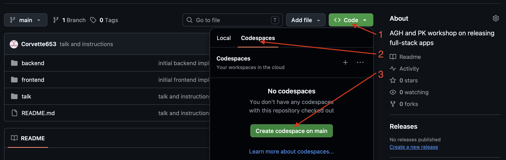

# Releasing Workshop

Jeśli tu jesteś, prawdopodobnie chcesz zrobić własną kopię tego repozytorium.

Możesz to zrobić klikając "Fork" w prawym górnym rogu tej strony.

Polecam development w Github Workspaces. Działa w przeglądarce, wygląda jak VS Code i ma preinstalowane wszystkie potrzebne narzędzia.

## Jak uruchomić Github Codespaces



Poczekaj aż cały codespace się załaduje, to może zająć minutę / dwie. Jeśli nie widzisz dolnego panelu z terminalem, możesz go pokazać / ukryć skrótem klawiszowym ctrl + j, lub ikonką w prawym, górnym rogu.

## Wymagania do pracy lokalnej

Jeśli chcesz jednak pracować lokalnie, to musisz mieć zainstalowanego [Gita](https://git-scm.com/downloads). Następnie skopiuj URL dostępny pod zielonym przyciskiem "Code" i w terminalu uruchom:
```
git clone <URL>
```

Upewnij się również, że masz zainstalowanego (i działającego!) [Pythona](https://www.python.org/downloads/), oraz [Dockera](https://www.docker.com/products/docker-desktop/).


## Jak uruchomić aplikację lokalnie

Niezależnie czy pracujesz w Codespace czy masz pobrany kod na własny komputer, te kroki wyglądają tak samo

Tworzymy 3 konsole

- w pierwszej uruchamiamy bazę danych:
```
$ cd backend/
$ docker compose up
```
- w drugiej uruchamiamy backend:
```
$ cd backend/
$ pip install -r requirements.txt
$ uvicorn main:app --reload
```
- w trzeciej uruchamiamy frontend:
```
$ cd frontend/
$ python -m http.server 8000
```

Wszystkie wprowadzone przez nas zmiany w kodzie będą od razu widoczne w przeglądarce.

### To wszystko. Do zobaczenia na warsztatach!
