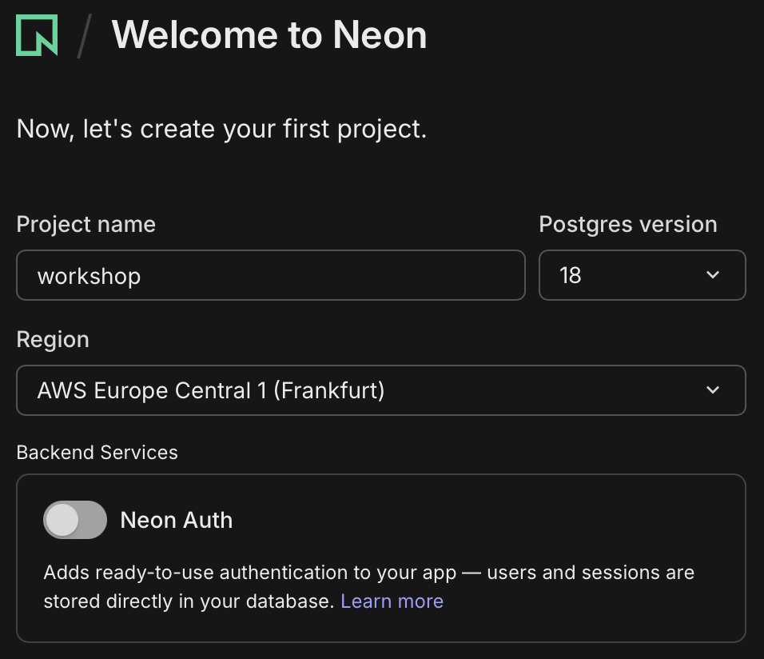
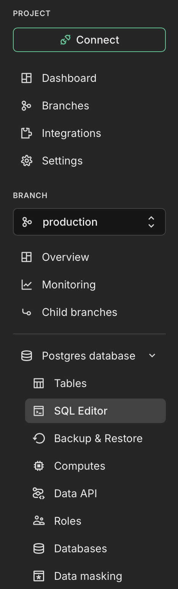
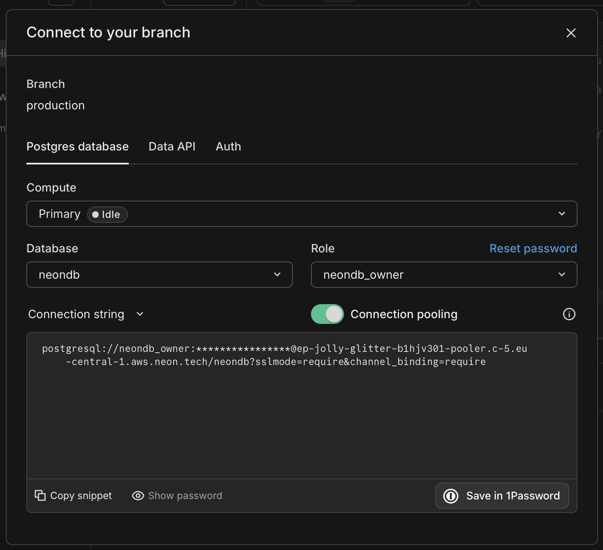
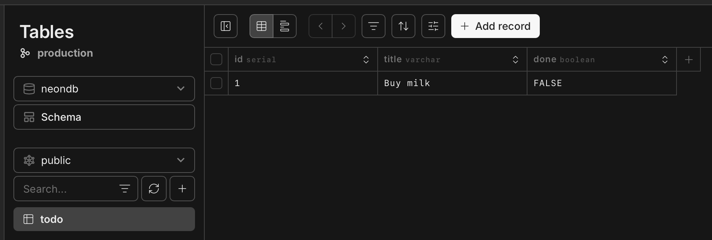

# Wystawiamy bazę danych w świat

Teraz postawimy prawdziwą, dostępną z internetu bazę danych Postgres na [Neon](https://neon.com) — za darmo i bez instalowania czegokolwiek na swoim komputerze.

## 1. Zakładamy konto na Neon

Wejdź na https://neon.com, załóż konto i je aktywuj. Standardowa procedura — mail, klik w link, gotowe. Nikt Cię tu nie zaskoczy.

## 2. Tworzymy projekt

Nazwij projekt jak chcesz, wybierz najnowszą wersję Postgresa i region najbliższy sobie — mniejsze opóźnienia, szybsze zapytania, mniej czekania. `Neon Auth` zostaw wyłączone, nie potrzebujemy go.



## 3. Tworzymy schemat bazy

Wejdź do **SQL Editor** — to miejsce, w którym można rozmawiać z bazą danych bezpośrednio z przeglądarki.



Naszym zadaniem jest odtworzyć w bazie to, co już znamy z kodu — nasz model `Todo`:
```
class Todo(SQLModel, table=True):
    id: int | None = Field(default=None, primary_key=True)
    title: str
    done: bool = False
```

**Uwaga:** Neon lubi podsuwać przykładowy kod SQL na start. Nie odpalaj go - zakomentuj albo po prostu usuń.

<details>
<summary>Jeśli nie masz pomysłu jak przełożyć klasę Pythona na SQL, zerknij tutaj (ale najpierw spróbuj sam!)</summary>

```
CREATE TABLE todo (
    id SERIAL NOT NULL,
    title VARCHAR NOT NULL,
    done BOOLEAN NOT NULL,
    PRIMARY KEY (id)
);
```
</details>

## 4. Sprawdzamy, czy to naprawdę działa

Spróbujmy połączyć się z naszą nową bazą, ale z zewnątrz, czyli z naszego lokalnego komputera - będzie to niezbity dowód no to, że baza faktycznie żyje gdzieś w internecie, a nie tylko w oknie przeglądarki.

Najpierw doinstalujmy sobie pythonową bibliotekę, który to ułatwi:
```bash
pip install sqlmodel
```

Teraz wskakujemy do konsoli Pythona i uruchamiamy na przykład:
```python
from sqlmodel import Session, create_engine, text

engine = create_engine(<twój connection string>)
session = Session(engine)

session.exec(text("INSERT INTO todo (title, done) VALUES ('Buy milk', False)"))
session.commit()

session.exec(text("SELECT * FROM todo")).all()
```

Connection string znajdziesz pod zielonym przyciskiem **Connect** w lewym górnym rogu.



Na koniec przejdź do sekcji **Tables** na stronie Neon i sprawdź, czy dodany przez Ciebie rekord tam faktycznie jest. Jeśli tak — gratulacje, Twój laptop i serwer Neon w chmurze potrafią się porozumiewać.



## Gratulacje

Właśnie postawiłeś/aś bazę danych dostępną z każdego miejsca na świecie (o ile jest tam internet).
