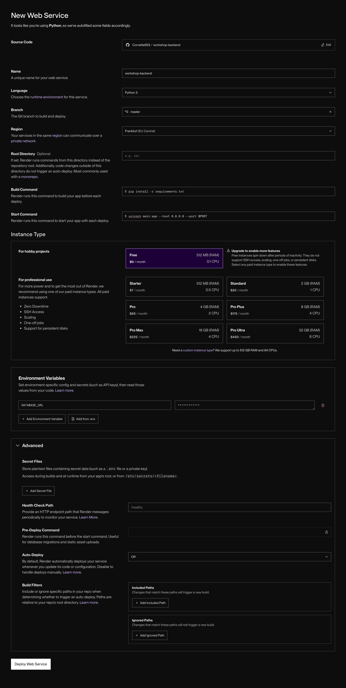
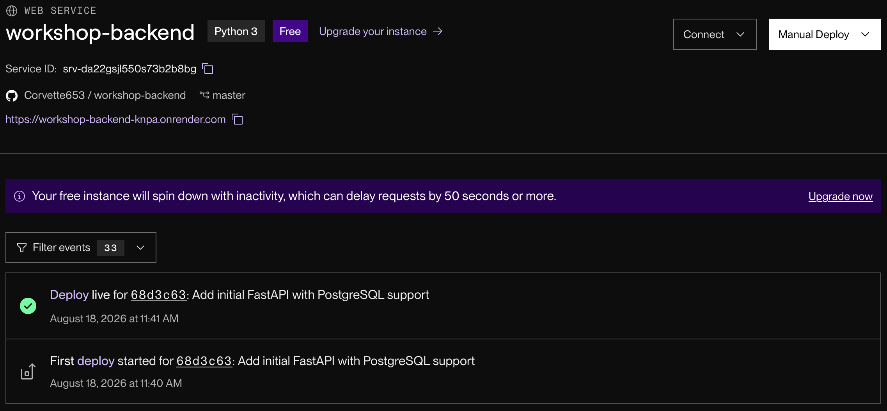

# Wystawiamy backend w świat

Nasz backend na razie żyje tylko na naszym laptopie — nikt inny nie może się z nim połączyć. Czas to zmienić i postawić go na [Render](https://render.com), żeby ktokolwiek (na przykład Ty, z telefonu) mógł go odwiedzić.

## 1. Tworzymy konto na Render

Wejdź na https://render.com i załóż konto. Bez zaskoczeń — mail, hasło, klik.

## 2. Tworzymy Web Service

Kliknij jeden z wielu przycisków `New` widocznych na stronie, żeby wystawić nowy Web Service. Render daje Ci 3 sposoby na dostarczenie kodu:
- zalogowanie się przez GitHub / GitLab / Bitbucket i danie Renderowi dostępu do repozytorium
- podanie linku do publicznego repozytorium na GitHubie
- podanie linku do obrazu Dockera z Twoją aplikacją

My pójdziemy w stronę publicznego linku. To nie jest najlepsze rozwiązanie na dłuższą metę (w realnym projekcie Twoje repozytorium będzie prywatne, Ty będizesz chciał żeby Render sam odświeżał aplikację po każdym pushu), ale na pewno najszybsze — i nie musisz nikomu nadawać żadnych uprawnień. Dzięki temu możesz też po prostu wystawić aplikację prosto z mojego repo, `https://github.com/Corvette653/workshop-backend`, jeśli nie chcesz sobie robić forka.



Przejdźmy przez widoczne tu opcje po kolei:

- **Source Code** — skąd wziąć kod
- **Name** — czysto dla Twojej wygody, żeby odróżniać aplikacje, jeśli masz ich więcej
- **Language** — w jakim języku napisałeś/aś aplikację. Render musi wiedzieć, jakiego kompilatora/interpretera użyć
- **Branch** — w jednym repozytorium na GitHubie może być wiele wersji kodu, Render musi wiedzieć, którą dokładnie wziąć
- **Region** — w którym centrum danych postawić aplikację. Im bliżej, tym mniejsze opóźnienia
- **Root Directory** — czasem aplikacja jest zagnieżdżona w folderach typu `my-project/code/src/`. Nasza nie jest, więc to pole zostawiamy puste
- **Build Command** — komenda, która zamienia Twój kod w działającą aplikację. Gdybyś pisał/a w C czy C++, tu byś podał/a komendę kompilującą. My używamy Pythona, więc nic nie kompilujemy — musimy za to doinstalować biblioteki, których używamy
- **Start Command** — komenda, którą Render odpala, żeby faktycznie uruchomić aplikację. W naszym przypadku to `uvicorn main:app --host 0.0.0.0 --port $PORT`

  <details>
  <summary>Skąd ta komenda i co właściwie robi? Rozwiń, jeśli jesteś ciekawy/a — jeśli nie, śmiało jedź dalej.</summary>

  Zacznijmy od najprostszego pomysłu — czemu nie odpalić po prostu `python main.py`? Co by się wtedy stało? Python zinterpretowałby nasz kod, stworzyłby silnik połączenia z bazą, klasy `Todo` i `TodoCreate`, zainicjalizował FastAPI, poustawiał endpointy i... zamknąłby aplikację. Nie ma już żadnych kolejnych instrukcji do wykonania. Task failed successfully.

  Dobra, więc jak utrzymać apkę przy życiu? Moglibyśmy dodać na koniec `while True: pass` — to by ją trzymało uruchomioną, a nasze FastAPI czekałoby na połączenia. Ale skąd te połączenia miałyby się brać? Użytkownik wchodzi na naszą stronę, pakiet HTTP dociera do naszego serwera i... nic nie wie, co z nim zrobić. I to jest właśnie problem, który rozwiązuje uvicorn: słucha pakietów przychodzących do serwera i przekazuje je naszej aplikacji, a kiedy ta skończy pracę, uvicorn bierze zwróconą wartość, odpowiednio ją parsuje i odsyła z powrotem jako odpowiedź HTTP.

  Skoro już wiemy, do czego służy uvicorn, przyjrzyjmy się samej komendzie: `uvicorn main:app --host 0.0.0.0 --port $PORT`.
  - `main:app` mówi uvicornowi, dokąd kierować ruch — `main` to moduł (czyli, w uproszczeniu, plik) Pythona, a `app` to obiekt aplikacji. Chcemy w końcu, żeby żądania obsługiwał FastAPI, a nie silnik bazy danych.
  - `--host 0.0.0.0 --port $PORT` mówi, skąd uvicorn ma przyjmować ruch. `0.0.0.0` to swojego rodzaju wildcard — obsługujemy cały ruch, niezależnie czy przychodzi z samej maszyny (localhost), czy z jednej karty sieciowej, czy z drugiej. `$PORT` to zmienna dostarczana przez Render — mówi, na jakim porcie TCP ma czekać na przychodzący ruch.
  </details>

- **Instance Type** — no jasne, że ten darmowy
- **Environment Variables** — tu wpisujemy konfigurację i sekrety, których nie chcemy trzymać w kodzie na stałe. Connection string do bazy danych to podręcznikowy przykład.

  **To jest ten moment** — dodaj tutaj zmienną `DATABASE_URL` z wartością connection stringa, który dostałeś/aś od Neona (patrz `db-setup.md`). Bez tego Twoja aplikacja spróbuje połączyć się z bazą na `localhost`, która na serwerach Render po prostu nie istnieje — i padnie już przy starcie.
- **Secret Files** — kolejny sposób na przekazanie sekretnych wartości do aplikacji
- **Health Check Path** — możesz tu podać ścieżkę, którą Render będzie odwiedzał co kilka sekund, żeby sprawdzić, czy aplikacja żyje. Jeśli nie — może ją zrestartować albo poinformować Cię wielkim czerwonym ostrzeżeniem
- **Pre-Deploy Command** — komenda odpalana między build a start commandem. W tym momencie aplikacja jest już zbudowana i gotowa — możesz tu np. zaktualizować schemat bazy albo wysłać sobie powiadomienie
- **Auto-Deploy i Build Filters** — pozwalają zautomatyzować wydawanie nowych wersji. Można np. ustawić, żeby Render obserwował branch `master` i sam aktualizował aplikację po każdym pushu

## 3. Weryfikacja konta

Render ma darmowy plan, ale i tak wymaga podania karty kredytowej, żeby zweryfikować konto. Bez obaw — nie musisz podawać swojej, zapewnimy Ci naszą. Jeśli jednak kiedyś w przyszłości trafisz na podobną sytuację poza warsztatami, dobrym rozwiązaniem jest tymczasowa wirtualna karta z Revoluta — można ją usunąć od razu po weryfikacji.

## 4. Weryfikacja aplikacji

### Logi z deployu

Sprawdźmy, czy wszystko poszło gładko.

Powinieneś/aś zobaczyć, jak Render ściąga kod:
```
==> Cloning from https://github.com/Corvette653/workshop-backend
==> Checking out commit 68d3c637552e516319be087dcb753059a24eeed1 in branch master
==> Using Python version 3.14.3 (default)
```

Odpala build command i ściąga wszystkie zależności:
```
==> Running build command 'pip install -r requirements.txt'...
Collecting fastapi (from -r requirements.txt (line 1))
...
Downloading fastapi-0.141.1-py3-none-any.whl (131 kB)
...
Installing collected packages: websockets, uvloop, typing-extensions, pyyaml, python-dotenv, psycopg2-binary, idna, httptools, h11, greenlet, click, annotated-types, annotated-doc, uvicorn, typing-inspection, SQLAlchemy, pydantic-core, anyio, watchfiles, starlette, pydantic, sqlmodel, fastapi

Successfully installed SQLAlchemy-2.0.52 annotated-doc-0.0.5 annotated-types-0.8.0 anyio-4.14.2 click-8.4.2 fastapi-0.141.1 greenlet-3.5.5 h11-0.16.0 httptools-0.8.0 idna-3.19 psycopg2-binary-2.9.12 pydantic-2.13.4 pydantic-core-2.46.4 python-dotenv-1.2.3 pyyaml-6.0.3 sqlmodel-0.0.39 starlette-1.6.0 typing-extensions-4.16.0 typing-inspection-0.4.4 uvicorn-0.52.3 uvloop-0.22.1 watchfiles-1.2.0 websockets-17.0.1
```

Odpala start command:
```
==> Running 'uvicorn main:app --host 0.0.0.0 --port $PORT'
...
INFO:     Application startup complete.
INFO:     Uvicorn running on http://0.0.0.0:10000 (Press CTRL+C to quit)
```

I na koniec informuje, że usługa żyje, razem z linkiem do niej:
```
==> Your service is live 🎉
==> 
==> ///////////////////////////////////////////////////////////
==> 
==> Available at your primary URL https://workshop-backend-knpa.onrender.com
==> 
==> ///////////////////////////////////////////////////////////
```

### Odwiedzamy aplikację

Adres URL znajdziesz też na stronie głównej Twojej aplikacji na Render:



Odwiedź endpoint `/todos`, żeby sprawdzić, czy dane z bazy są dostępne, albo automatycznie wygenerowaną stronę `/docs`, żeby poeksperymentować z całym API.

**Zapisz sobie ten adres** — będzie nam potrzebny w kolejnym kroku, gdy podłączymy do niego frontend.

Jeśli `/todos` odpowiada błędem 500, to najpierw sprawdź, czy dodałeś/aś zmienną `DATABASE_URL` (krok 2 wyżej) i czy connection string jest poprawnie skopiowany z Neona. Jeśli wszystko wygląda dobrze, a błąd nadal się pojawia — spróbuj odpytać endpoint jeszcze raz po chwili. Darmowe usługi na Render usypiają po czasie bezczynności, a pierwsze zapytanie po przebudzeniu bywa kapryśne.
