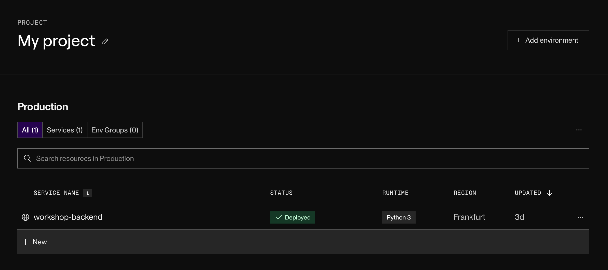
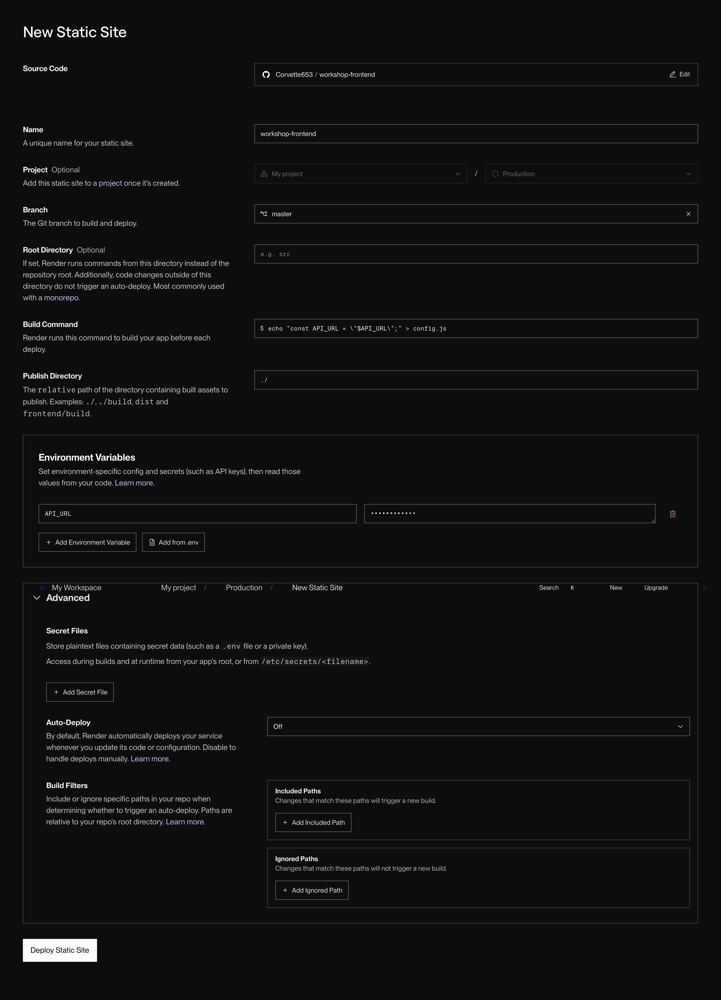

# Wystawiamy frontend w świat

Nareszcie coś, co użytkownik faktycznie zobaczy! Teraz zajmiemy się frontendem, żeby ludzie mogli po prostu wejść na stronę (to ważna część aplikacji, pamiętaj — niewiele osób będzie chciało ręcznie wysyłać zapytania do API).

## 1. Tworzymy Static Site

Do hostowania frontendu też użyjemy Render. Pójdzie gładko, bo konto już mamy gotowe. Wejdź na stronę główną swojego projektu (Render pewnie nazwał go automatycznie `My Project`) i użyj przycisku `New`, żeby stworzyć nową usługę.



Tym razem nie potrzebujemy całego serwera — wystarczy magazyn, który wyśle nasze pliki do przeglądarki użytkownika na żądanie. Więc zamiast `Web Service`, wybierz `Static Site`.



Znowu możesz użyć swojego repozytorium/forka albo podać link do mojego: `https://github.com/Corvette653/workshop-frontend`.

Większość pól wygląda tak samo jak przy backendzie, więc nie będziemy się nad nimi rozwodzić po raz drugi. Skupmy się na tych, które są inne albo mają inne wartości:

- **Publish Directory** — odpowiednik `Root Directory` z backendu. U nas pliki leżą w katalogu głównym, więc wpisujemy `./` - nie może zostać puste.

- **Environment Variables** — tym razem nie łączymy się z bazą danych, frontend musi tylko dotrzeć do backendu. Dodaj zmienną o nazwie **`API_URL`** i wpisz jako wartość adres backendu, który zanotowałeś sobie w poprzednim kroku.

- **Build Command** — nasza aplikacja nie wymaga budowania — to czysty vanilla JS, bez żadnych zależności do ściągnięcia. Frontend, w przeciwieństwie do backendu, nie ma jednak dostępu do zmiennych środowiskowych sam z siebie (przeglądarka nie wie, co to Render). Rozwiązujemy to właśnie build commandem:
  ```bash
  echo "const API_URL = \"$API_URL\";" > config.js
  ```
  Ta komenda wpisuje adres backendu prosto do pliku `config.js`, który jest już podpięty w `index.html`. To bardzo manualne rozwiązanie — w prawdziwych projektach dzieje się to jako część `npm run build`, ale mechanizm pod spodem jest identyczny.

## 2. Weryfikacja aplikacji

### Logi z deployu

Sprawdźmy, czy wszystko poszło gładko.

Podobnie jak wcześniej, powinieneś/aś zobaczyć, jak Render ściąga kod:
```
==> Cloning from https://github.com/Corvette653/workshop-frontend
==> Checking out commit 2b771f94414aaea5060dadc17a527c89f566cef7 in branch master
```

Odpala build command:
```
==> Running build command 'echo "const API_URL = \"$API_URL\";" > config.js'...
```

I to tyle — nie ma co więcej robić:
```
==> Uploading build...
==> Your site is live 🎉
```

### Odwiedzamy aplikację

Tym razem adresu nie znajdziesz w logach — ale jest podany tuż nad nimi :)

Przy pierwszym wejściu na stronę pamiętaj, że backend albo baza danych mogły w tym czasie zasnąć — obudzenie ich może potrwać kilka / kilkanaście sekund. Jeśli dodawanie zadania nie działa od razu, po prostu poczekaj chwilę i odśwież stronę.

Jeśli po chwili nadal nic się nie dzieje, zajrzyj do pliku `config.js` w konsoli przeglądarki — to najbardziej prawdopodobny kandydat na buga.

## Gratulacje

Twoja aplikacja właśnie stała się prawdziwym, kompletnym produktem — frontend, backend i baza danych, każde w swoim miejscu, rozmawiające ze sobą przez publiczny interfejs API. Możesz już wysłać link znajomym (i przygotować się na to, że ktoś doda do listy 3 tysiące chomików dżungarskich).
