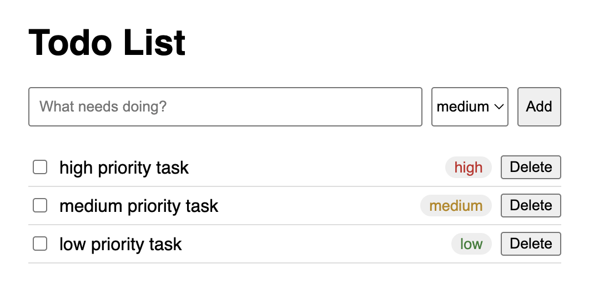

# Ćwiczenie: dodaj priorytety zadań

Czas przestać podążać za instrukcją. Rozszerz aplikację o nową funkcjonalność, a następnie, na podstawie wiedzy z poprzednich ćwiczeń, opublikuj nową wersję.

## Cel

Użytkownik, dodając nowe zadanie, powinien móc określić jego priorytet: **niski / średni / wysoki**. Lista zadań ma być posortowana tak, żeby najważniejsze rzeczy były na górze.

## Co ma działać na koniec

- Formularz dodawania zadania pozwala wybrać priorytet (domyślnie: średni)
- Priorytet zadania jest widoczny na liście
- Lista zadań jest posortowana po priorytecie — najpierw wysoki, potem średni, na końcu niski
- Nie trzeba zmieniać priorytetu po utworzeniu zadania — wystarczy, że da się go ustawić raz, podczas dodawania

## Na co warto zwrócić uwagę

Ta zmiana dotyka wszystkich trzech warstw naszej aplikacji — będziesz musiał/a:
- dodać nową kolumnę w bazie danych (nowa informacja = nowe miejsce, żeby ją przechować)
- rozszerzyć backend tak, żeby przyjmował i zwracał tę nową informację
- dodać do frontendu input na priorytet i etykietę aby był widoczny na liście

Utknąłeś/aś?

Poproś o pomoc jednego z prowadzących, lub porozmawiaj z kolegą obok ;)

## Co dalej

Kiedy już to zadziała lokalnie - pamiętaj, że wszystkie elementy są już wystawione w internecie. Zmiana w kodzie sama się tam nie pojawi - trzeba będzie ją wypchnąć do repozytorium i ponownie zdeployować.
